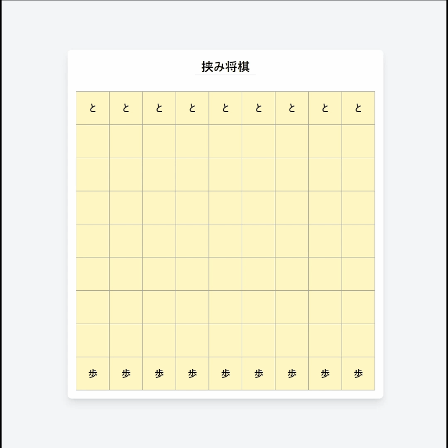

# hasami-shogi

挟み将棋で遊べるウェブアプリケーションです。



## Tech Stack
- **Language**: Python 3.9
- **Framework**: Flask
- **Frontend**: TailwindCSS

## Getting Start
1. ```sh
   python -m venv venv
   ```
2. （for Windows）  
   ```sh
   .\venv\Scripts\activate
   ```
3. ```sh
   pip install -r requirements.txt
   ```
4. ```sh
   python .\run.py
   ```
5. Access http://localhost:5000/
